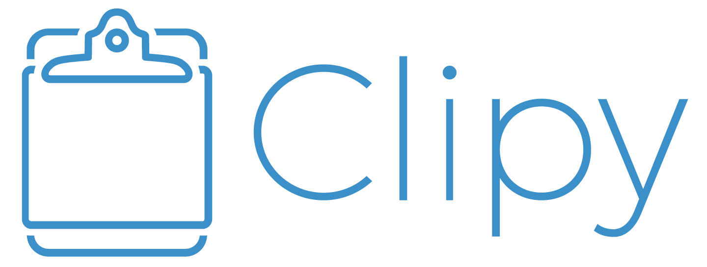

  

 

Qlypx is a Clipboard extension app for macOS.

---

__Requirement__: macOS 10.10 Yosemite or higher

__Distribution Site__ : <https://qlypx-app.com>

### Development Environment
* macOS 10.15 Catalina
* Xcode 12.2
* Swift 5.3

### How to Build
0. Move to the project root directory
1. `bundle install --path=vendor/bundle && bundle exec pod install`
2. Open `Qlypx.xcworkspace` on Xcode.
3. build.

### Contributing
1. Fork it ( https://github.com/Qlypx/Qlypx/fork )
2. Create your feature branch (`git checkout -b my-new-feature`)
3. Commit your changes (`git commit -am 'Add some feature'`)
4. Push to the branch (`git push origin my-new-feature`)
5. Create a new Pull Request

### Localization Contributors
Qlypx is looking for localization contributors.  
If you can contribute, please see [CONTRIBUTING.md](https://github.com/Qlypx/Qlypx/blob/master/.github/CONTRIBUTING.md)

### Distribution
If you distribute derived work, especially in the Mac App Store, I ask you to follow two rules:

1. Don't use `Qlypx` and `ClipMenu` as your product name.
2. Follow the MIT license terms.

Thank you for your cooperation.

### Backers

Support us with a monthly donation and help us continue our activities. [[Become a backer](https://opencollective.com/qlypx#backer)]

### Sponsors

Become a sponsor and get your logo on our README on Github with a link to your site. [[Become a sponsor](https://opencollective.com/qlypx#sponsor)]

### Licence
Qlypx is available under the MIT license. See the LICENSE file for more info.

Icons are copyrighted by their respective authors.

### Special Thanks
__Thank you for [@naotaka](https://github.com/naotaka) who have published [ClipMenu](https://github.com/naotaka/ClipMenu) as OSS.__
